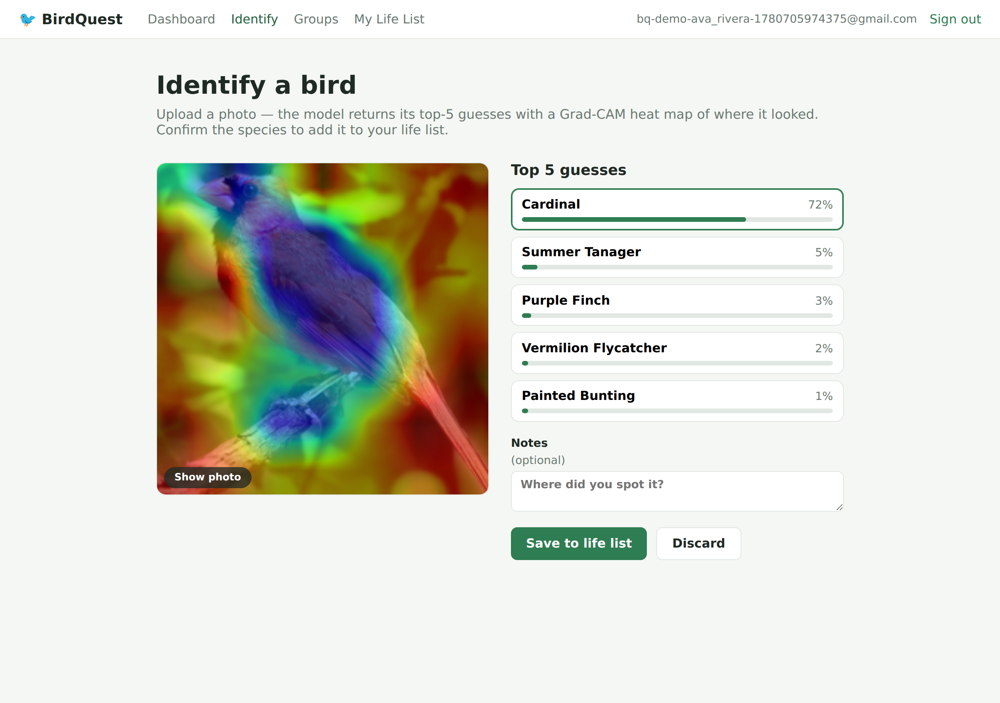
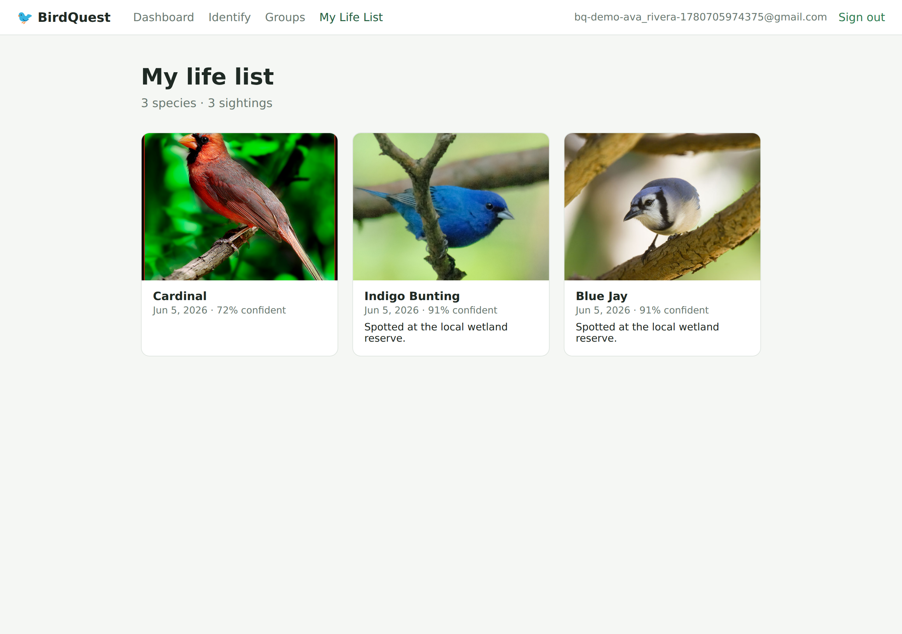
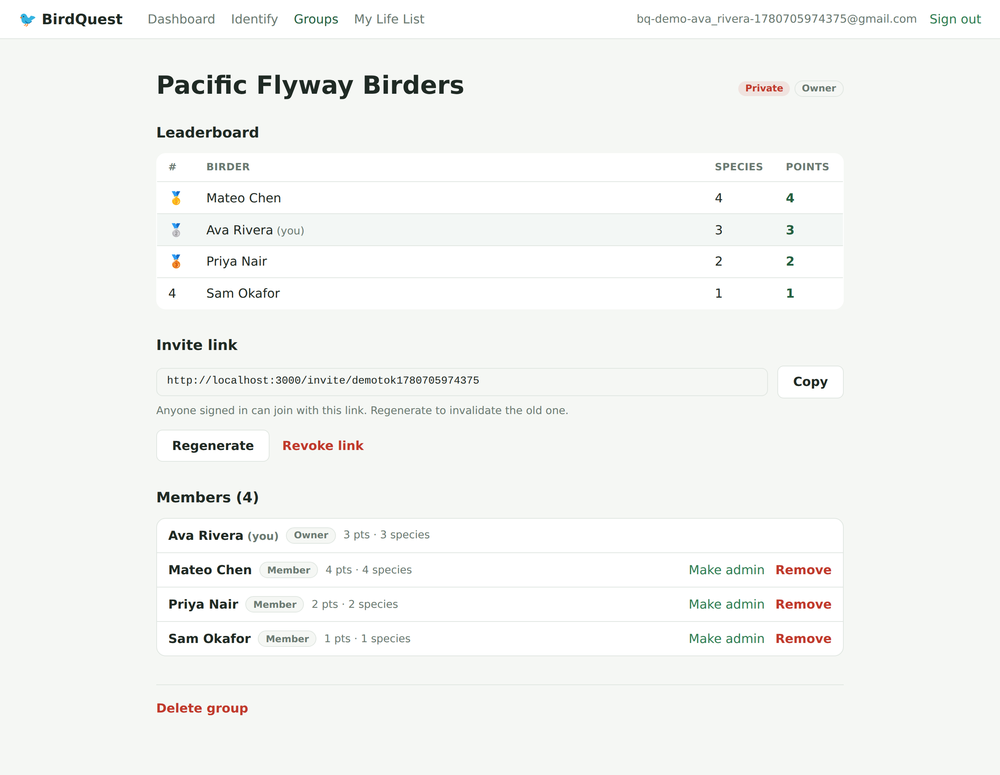
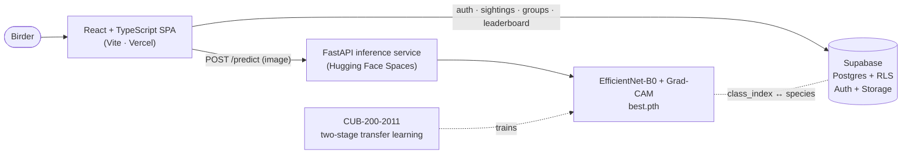

# 🐦 BirdQuest

**Letterboxd for birding, powered by a bird-species classifier I trained.**
Photograph a bird → a fine-grained image model I trained on CUB-200-2011 names the
species and shows *where it looked* (Grad-CAM) → confirm it to build your life list,
form groups, and climb a rarity-weighted leaderboard.

> An end-to-end machine-learning project: **data → training → evaluation → model
> serving → a real product → deployed.** The trained model is the centerpiece; the
> React + Supabase app is the wrapper that proves end-to-end ML delivery.

**Live demo:** _frontend →_ `https://<your-app>.vercel.app` · _model API →_
`https://<your-user>-birdquest-api.hf.space/docs`
<!-- Replace the two URLs above after deploying (see DEPLOY.md). -->



> *Upload a Northern Cardinal; the model returns its top-5 guesses — note that the
> runners-up (Summer Tanager, Vermilion Flycatcher, Painted Bunting) are all red
> birds — with a Grad-CAM heat map localizing the bird it classified.*

---

## What it does

- **Identify** — upload a photo; the model returns **top-5 candidate species with
  calibrated confidences** plus a **Grad-CAM** overlay of the pixels that drove the
  prediction.
- **Life list** — confirm the species among the top-5 (a human-in-the-loop labeling
  step) and it's saved with the photo and the full prediction.
- **Groups & leaderboard** — create private groups, invite friends with a reusable
  link, and compete on a **rarity-weighted** leaderboard (distinct confirmed species).

| Life list | Group leaderboard |
|---|---|
|  |  |

---

## Architecture



- The **only custom backend is the ML service** — generic CRUD (groups, scoring)
  lives in Postgres behind Supabase RLS, so the ML stays the star and scope stays small.
- `species.class_index` is the contract between the model's output classes and the
  database catalog; `sightings.model_top5` (jsonb) preserves every prediction as
  labeled data for a future **retraining flywheel**.

---

## The model (centerpiece)

Fine-grained visual classification — telling visually similar species apart (a
Common vs. a Forster's Tern) — on **CUB-200-2011** (200 species, ~11,788 images),
the standard FGVC benchmark.

| | |
|---|---|
| **Backbone** | EfficientNet-B0, ImageNet-pretrained |
| **Approach** | Two-stage transfer learning (freeze → fine-tune), AMP, batch 16 × accum 2 |
| **Top-1 accuracy** | **78.3%** (5,794 test images) |
| **Top-5 accuracy** | **95.1%** |
| **Explainability** | Grad-CAM implemented from scratch |
| **Compute** | One laptop RTX 3050 (4 GB VRAM) via WSL2 — ~13 min to train |

The hardest confused pairs are real field-ID challenges — **Common vs. Forster's
Tern**, **Eared vs. Horned Grebe**, **Tree vs. House Sparrow** — evidence the model
learned genuine fine-grained features rather than shortcuts. Full evaluation,
confusion analysis, and training details: [`bird-model/`](bird-model/README.md) ·
[`metrics.md`](bird-model/checkpoints/metrics.md).

---

## Tech stack

- **ML / serving:** PyTorch + torchvision, FastAPI, Grad-CAM (from scratch); CPU
  Docker image for deploy.
- **Frontend:** React 19, TypeScript (strict), Vite, React Router.
- **Backend-as-a-service:** Supabase — Postgres, Row-Level Security, Auth, Storage.
- **Deploy:** Vercel (frontend) · Hugging Face Spaces (model API) — see [DEPLOY.md](DEPLOY.md).

## Repo layout

```
bird-model/          ML core: training, eval, Grad-CAM, and the FastAPI service (serve/)
bird-game-frontend/  React + TypeScript SPA (Vite)
supabase/            Postgres schema, RLS policies, leaderboard view, seed (version-controlled)
docs/screenshots/    images used in this README
PLAN.md              full project roadmap and ML-resume framing
DEPLOY.md            step-by-step production deploy guide
```

Each subdirectory has its own README with deeper detail.

---

## Run it locally

Needs a Supabase project (apply `supabase/migrations/` + `seed.sql` — see
[`supabase/README.md`](supabase/README.md)) and Python 3.12 + Node 18+.

**1. Model API** (`bird-model/`)
```bash
cd bird-model
python3 -m venv .venv
.venv/bin/pip install torch torchvision --index-url https://download.pytorch.org/whl/cu121
.venv/bin/pip install -r requirements.txt
.venv/bin/python -m uvicorn serve.main:app --port 8000
```
> No GPU? Install the CPU torch wheels instead (`.../whl/cpu`); single-image
> inference runs fine on CPU. To train from scratch, see `bird-model/README.md`.

**2. Frontend** (`bird-game-frontend/`)
```bash
cd bird-game-frontend
npm install
cp .env.example .env.local   # fill in Supabase URL + anon key; API defaults to :8000
npm run dev                  # http://localhost:3000
```

End-to-end smoke checks against a live Supabase live in
`bird-game-frontend/scripts/verify_*.mjs`.

---

## Roadmap

Built in three phases (ML core → serving + app spine → social + ship); see
[PLAN.md](PLAN.md). **Stretch:** eBird-frequency rarity tiers (the leaderboard is
already rarity-weighted, currently all-Common), NABirds for broader coverage, and
the user-confirmation retraining flywheel.
